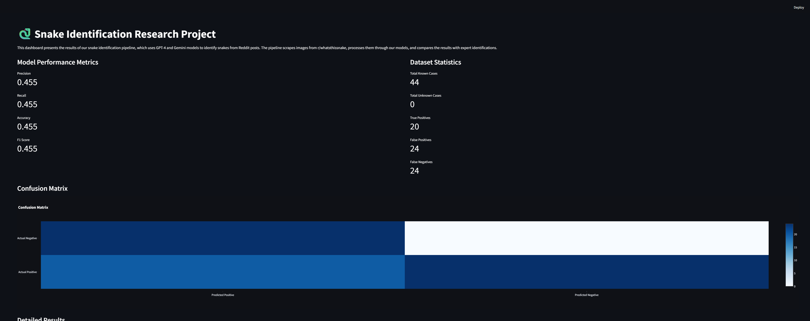
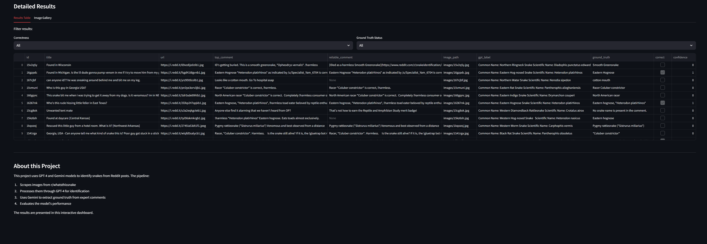
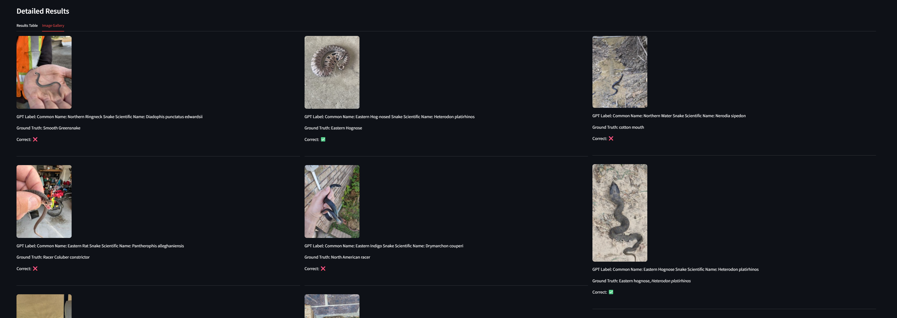

# 🐍 Reddit Snake Identifier Pipeline

**Discover, classify, and analyze snakes from Reddit images with cutting-edge AI — all in your browser!**

This project is an automated pipeline that scrapes image posts from the `r/whatsthissnake` subreddit, classifies the snake in each image using GPT-4o (and soon, other models!), and evaluates the results using Google's Gemini model. Explore and analyze results interactively with a beautiful Streamlit dashboard.

---

## 🌐 Interactive Streamlit Dashboard

- **Visualize** model predictions, ground truth, and evaluation metrics
- **Filter** and search results by correctness, ground truth status, and more
- **Browse** images and predictions in a gallery view
- **Confusion matrix** and performance metrics at a glance
- **No more static PDFs — everything is live and interactive!**

### Launch the Dashboard

```bash
streamlit run app.py
```

Open the provided URL in your browser to explore the results.

---

## 🖼️ How it Looks





---

## 🚀 Features

- 🔎 Scrapes snake-related Reddit posts (images only)
- 🧠 Classifies snake species via OpenAI's GPT-4o (and more soon!)
- 📜 Extracts "ground truth" from Reddit user replies using Gemini LLM
- 📈 Evaluates predictions with precision, recall, accuracy, and F1
- 📂 Outputs results to CSV for further analysis
- 🌐 Interactive Streamlit dashboard for exploration

---

## 📁 Folder Structure

```
.
├── images/                  # Downloaded Reddit images
├── results/
│   └── classification_results.csv
├── app.py                   # Streamlit dashboard
├── snekid.py                # Main pipeline script
├── run.py                   # Pipeline runner
├── screenshots/             # Dashboard screenshots
```

---

## 🛠️ Requirements

- Python 3.9+
- [OpenAI API key](https://platform.openai.com/account/api-keys)
- [Gemini API key](https://makersuite.google.com/app)
- Reddit app credentials (for PRAW)

Install required packages:

```bash
pip install -r requirements.txt
```

---

## 🔑 Environment Variables

Set these in your environment (e.g., `.env`, bash profile, etc.):

```bash
REDDIT_CLIENT_ID=your_client_id
REDDIT_CLIENT_SECRET=your_client_secret
REDDIT_USER_AGENT=your_app_name

OPENAI_API_KEY=your_openai_api_key
GEMINI_API_KEY=your_gemini_api_key
```

---

## 🚀 How to Run

```bash
python run.py
```
Then launch the dashboard:
```bash
streamlit run app.py
```

---

## 📊 Evaluation Metrics

The script calculates:
- **Precision** = TP / (TP + FP)
- **Recall** = TP / (TP + FN)
- **Accuracy** = TP / (TP + FP + FN)
- **F1 Score** = 2 * (Precision * Recall) / (Precision + Recall)

---

## 📄 License

MIT License

---

## ✨ Future Ideas

- Compare multiple AI models (Gemini, Claude, DeepSeek, local LLMs)
- Fine-tune snake classification models
- Use CLIP or BLIP2 for fallback visual classification
- Add user-upload for custom image testing
